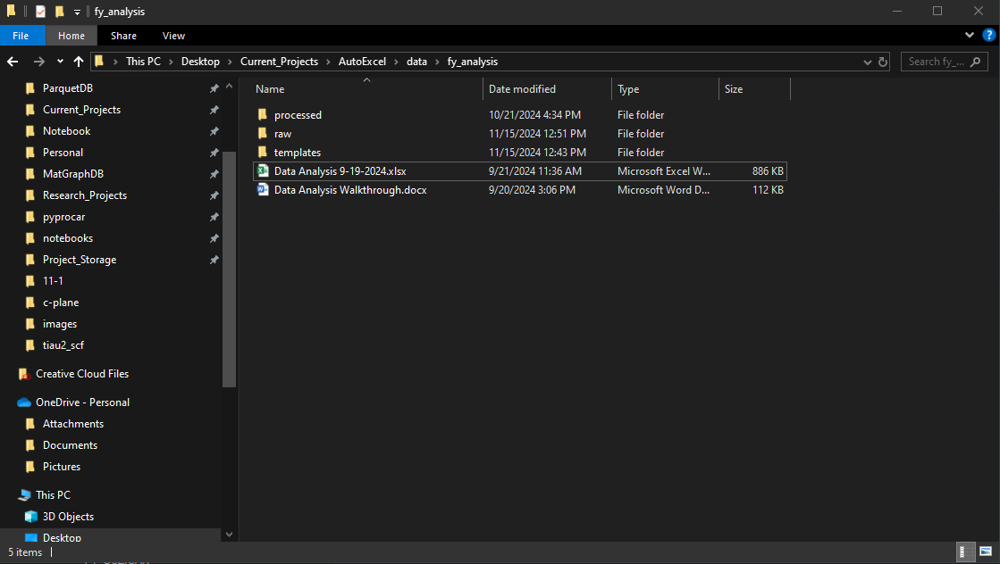
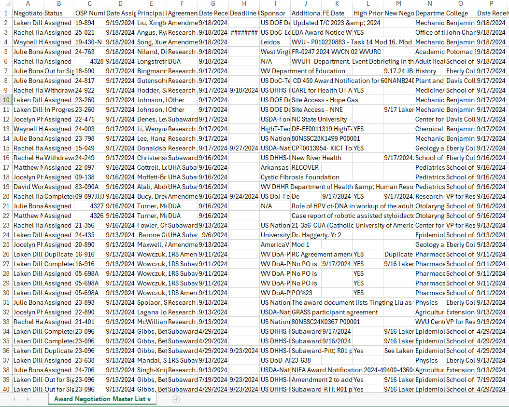
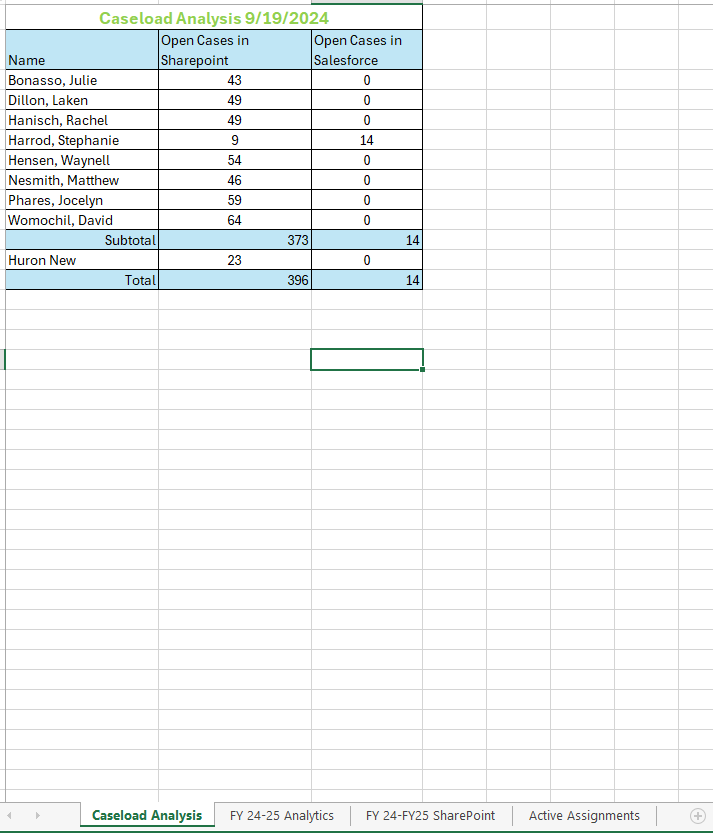
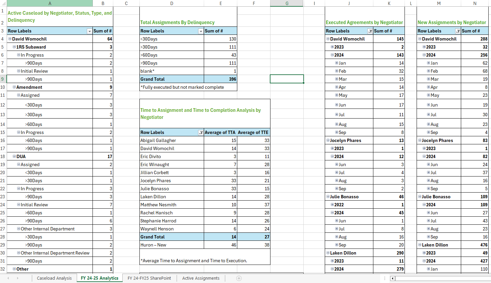
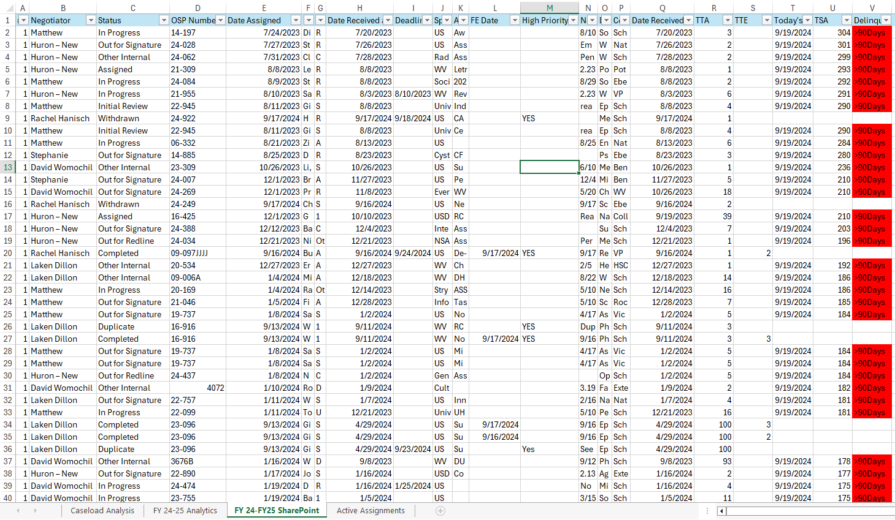
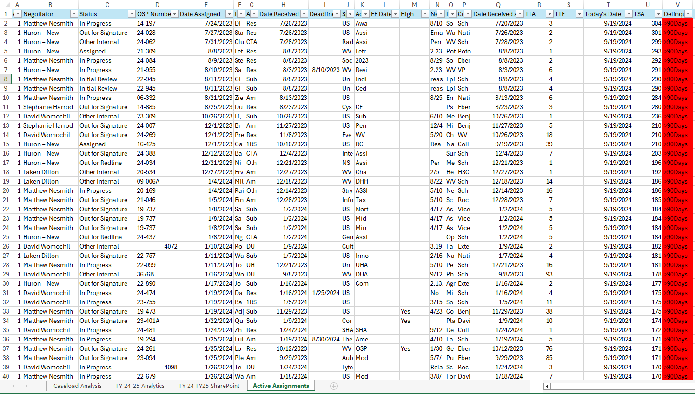

# AutoExcel README  

Welcome to the AutoExcel tool! This guide will help you get started, even if you have no prior coding experience. Follow these steps carefully to set up and run the tool.

---

## Prerequisites  

Before you start, you'll need to install two essential tools:

1. **Anaconda**: A Python package manager that comes with Python.  
2. **Visual Studio Code (VS Code)**: A code editor.  

Follow [this video tutorial](https://www.youtube.com/watch?v=uhwpJ0SaxFM) to install both Anaconda and VS Code.

---

## Download the Code  

1. Go to the [AutoExcel GitHub repository](https://github.com/lllangWV/AutoExcel).
2. Click the green **Code** button, then select **Download ZIP**.
3. Once downloaded, unzip the folder to a convenient location on your computer.

---

## Set Up the Environment  

1. Open the unzipped folder in **File Explorer**.
2. In the folder, click the search bar at the top, type `cmd`, and press Enter. This will open the **Command Prompt** in that folder.
3. In the Command Prompt, type the following command and press Enter:  
   ```bash
   conda env create -f env.yml
   ```
   This will create the required Anaconda environment.  
4. Once the environment is created, activate it by typing:  
   ```bash
   conda activate autoexcel
   ```

---

## Directory and File Descriptions

1. **Data Directory**:  
   - **Path**: `data/fy_analysis/`  
   - **Description**: This is the main directory containing all the necessary subdirectories and files for the script to work. It includes the `raw`, `templates`, and `processed` folders. The correct structure of this directory is crucial as the script relies on it to locate the input files and save the output.  
   - **Example View in File Explorer**:  
       

2. **Raw Data Directory**:  
   - **Path**: `data/fy_analysis/raw/`
   - **File**: `Raw Data 9-19-2024.xlsx`
   - **Description**: This is the raw input file containing the original data to be processed. Make sure this file is saved in the specified directory before running the script.

   ### Raw Data Directory and the file

   Below are example screenshots of the required worksheets within the template file:  

   - **Raw data file**  
       


3. **Template Directory**:  
   - **Path**: `data/fy_analysis/templates/`
   - **File**: `template_processed_workbook.xlsx`
   - **Description**: This template file defines the structure and layout applied to the raw data during processing. Place this file in the specified directory.

   ### Template File Overview  

   Below are example screenshots of the required worksheets within the template file:  

   - **Caseload Analysis Worksheet**  
       

   - **FY24-25 Analytics Worksheet**  
       

   - **FY24-25 SharePoint Worksheet**  
       

   - **Active Assignments Worksheet**  
       

   These worksheets provide the necessary formatting and structure for processing your data.


4. **Processed Data Directory**:  
   - **Path**: `data/fy_analysis/processed/`
   - **Description**: The processed output file will be saved here once the script is run. This directory stores the results after applying the template to the raw data.

---


## Run the Script  

In the Command Prompt, navigate to the folder containing the script and run:  
```bash
python autoexcel/main.py [OPTIONS]
```  
Replace `[OPTIONS]` with appropriate arguments based on your use case.

### Script Arguments

The script accepts several optional arguments to customize its behavior. Below are the details:

| Argument            | Description                                              | Default Value                                             |
|---------------------|----------------------------------------------------------|-----------------------------------------------------------|
| `--raw_xlsx`        | Relative path to the raw Excel file.                     | `data/fy_analysis/raw/Raw Data 9-19-2024.xlsx`            |
| `--template_xlsx`   | Relative path to the template Excel file.                | `data/fy_analysis/templates/template_processed_workbook.xlsx` |
| `--processed_dir`   | Output directory for the processed Excel file.           | `.` (current directory)                                    |
| `--data_dir`        | Path to the main data directory.                         | `data/fy_analysis`                                        |
| `--start_date`      | Start date for filtering data in `YYYY-MM-DD` format.    | `None` (includes all dates)                               |
| `--end_date`        | End date for filtering data in `YYYY-MM-DD` format.      | `None` (includes up to the latest date)                   |

### Example Command

To run the script with specific arguments, you can use the following command:  
```bash
python autoexcel/main.py --raw_xlsx fy_analysis/raw/CustomRawData.xlsx --template_xlsx fy_analysis/templates/CustomTemplate.xlsx --processed_dir /path/to/output --data_dir /custom/data/path --start_date 2023-01-01 --end_date 2023-12-31
```

### Argument Explanations

- **`--raw_xlsx`**: Specifies the raw Excel file to process. If not provided, the default file is used.
- **`--template_xlsx`**: Defines the template file used for processing the raw data.
- **`--processed_dir`**: Sets the directory where the processed Excel file will be saved.
- **`--data_dir`**: Points to the base data directory, which contains all necessary subdirectories and files.
- **`--start_date` & `--end_date`**: Used to filter data by a specific date range. If `start_date` is set to `2023-07-01` and `end_date` is `2023-12-31`, only data within this range will be included.

### Notes

- Ensure that all input files are in their respective directories.
- Adjust the `--start_date` and `--end_date` values as needed to filter data for your analysis.


---

## You're All Set!  

If you follow these steps, AutoExcel will process your data as expected. If you encounter any issues, feel free to revisit the steps or seek assistance.